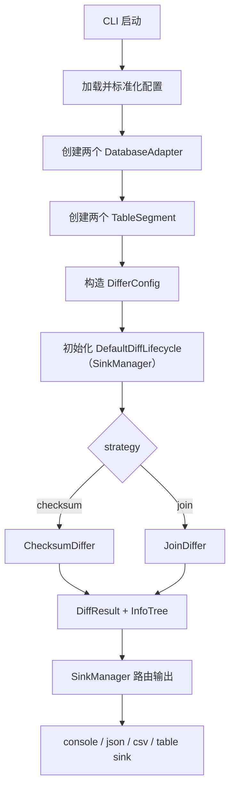

# 架构设计

本文描述当前代码的真实架构，不追求营销式描述，重点说明模块边界、执行链路和扩展点。

## 一、模块分层

### `consilens-sink`

职责：

- 统一 Sink SPI 接口（`Sink`、`SinkProvider`）
- Sink 注册与路由（`SinkRegistry`、`SinkManager`）
- 内置 sink 实现：`console`、`json`、`csv`、`table`，每种支持 `diff-record` 和 `result` 两种数据类型
- `DefaultDiffLifecycle`：将生命周期事件桥接到 `SinkManager`

子模块：

- `consilens-sink-api`：接口、配置模型、管理器
- `consilens-sink-plugins/*`：内置 format 实现
- `consilens-sink-all`：聚合全部内置 sink，供 CLI 统一引入

### `consilens-cli`

职责：

- 解析配置
- 创建数据库适配器
- 创建 `TableSegment`
- 选择比对策略
- 组织输出

核心类：

- [ConsilensCliApplication.java](../consilens-cli/src/main/java/com/consilens/cli/ConsilensCliApplication.java)
- [ConfigurationManager.java](../consilens-cli/src/main/java/com/consilens/cli/config/ConfigurationManager.java)
- [DiffService.java](../consilens-cli/src/main/java/com/consilens/cli/service/DiffService.java)

### `consilens-core`

职责：

- 比对算法
- 分段与递归
- 差异模型
- 线程池
- 数据库适配抽象

核心类：

- [TableDiffer.java](../consilens-core/src/main/java/com/consilens/core/algorithm/TableDiffer.java)
- [ChecksumDiffer.java](../consilens-core/src/main/java/com/consilens/core/algorithm/ChecksumDiffer.java)
- [JoinDiffer.java](../consilens-core/src/main/java/com/consilens/core/algorithm/JoinDiffer.java)
- [TableSegment.java](../consilens-core/src/main/java/com/consilens/core/segment/TableSegment.java)

### `consilens-connector`

职责：

- 数据库方言
- SQL 生成
- 类型标准化
- 元数据访问
- JDBC 驱动插件

### `consilens-spi`

职责：

- 通用插件加载器
- SPI 注册与实例缓存

### `consilens-dist`

职责：

- 发行包结构组装
- `bin/conf/libs/plugins` 打包

## 二、主执行链路

## 三、checksum 策略执行模型

`checksum` 是当前项目最重要的算法路径。

### 1. 根节点阶段

- 先获取两侧表的边界与总行数
- 建立有界分段
- 如果总行数已经低于阈值，直接本地比较
- 否则进入首轮分段

### 2. 首轮分段

- 根据 `bisectionFactor` 对较大一侧做首轮多分段
- 对应小表按相同边界生成镜像分段

### 3. 子段递归

每个子段先计算 count + checksum：

- 如果两侧 checksum 相等：直接跳过
- 如果段已足够小：本地拉数比较
- 如果段仍然很大：继续多路分段
- 否则：切换为真正二分

### 5. 终局本地比较

当段已经收敛到本地比较阈值后，当前实现默认使用 `full`，也可以通过配置显式切换到 `row-hash`：

- `full`
  直接把当前小段的完整行拉回本地做全量比对
- `row-hash`
  先拉主键 + `row_hash`，在内存中找出缺失键和哈希不一致键，再只回查这些键对应的完整行

这意味着：

- `checksum.algorithm` 负责“大段筛查”
- `strategy.localCompare.mode` 负责“小段精确定位”，默认是 `full`

### 4. 当前实现的阈值规则

- 首轮按 `bisectionFactor` 做多分段
- 子段在 `maxRows <= bisectionThreshold * bisectionFactor` 时切换到二分
- 当 `totalRows < bisectionThreshold` 时直接做本地比较

这套逻辑位于：

- [ChecksumDiffer.java](../consilens-core/src/main/java/com/consilens/core/algorithm/ChecksumDiffer.java)

## 四、join 策略执行模型

`join` 的特点是简单直接，但前提强：

- 两张表必须位于同一个 JDBC URL
- 通过数据库侧 JOIN SQL 一次性计算缺失和不一致

校验同库逻辑见：

- [JoinDiffer.validateSameDatabase](../consilens-core/src/main/java/com/consilens/core/algorithm/JoinDiffer.java#L625)

适用场景：

- 同库双表对账
- 希望直接依赖数据库 JOIN 能力

不适用场景：

- 跨库
- 异构 JDBC URL

## 五、差异结果模型

统一输出模型是 [DiffResult.java](../consilens-core/src/main/java/com/consilens/core/diff/DiffResult.java)，核心内容包括：

- `differences`
- `statistics`
- `infoTree`
- `metadata`

CLI 层再包装为：

- [CliDiffResult.java](../consilens-cli/src/main/java/com/consilens/cli/model/CliDiffResult.java)

差异操作类型：

- `SOURCE_MISSING`
- `TARGET_MISSING`
- `MISMATCH`

## 六、执行树 `infoTree`

`infoTree` 是当前排障和性能分析的重要数据结构。

每个节点可记录：

- 当前分段范围
- 两侧行数
- split 类型与 factor
- 差异数量
- 本地比较或跳过的决策
- 执行耗时

对应实现：

- [InfoTreeRecorder.java](../consilens-core/src/main/java/com/consilens/core/diff/InfoTreeRecorder.java)

## 七、线程模型

项目将 IO 与 CPU 线程池分离：

- IO 线程池：数据库访问、checksum 查询、row-hash 查询、行拉取
- CPU 线程池：本地差异计算、结果转换

配置入口：

- [ConcurrencyConfig.java](../consilens-core/src/main/java/com/consilens/core/thread/ConcurrencyConfig.java)

默认值特点：

- IO 池偏大
- CPU 池按核数比例配置

## 八、数据库插件架构

数据库方言使用组合模式，而不是在一个类中塞满所有能力。

一个方言暴露：

- `SqlQueryGenerator`
- `MetadataQueryGenerator`
- `DataTypeHandler`
- `TransactionManager`
- `CapabilityProvider`
- `ConnectionPoolOptimizer`

优点：

- 单一职责明确
- 新数据库可按组件逐步补齐
- 标准化逻辑可独立演化

## 九、发行包架构

发行包由 [assembly.xml](../consilens-dist/src/main/assembly/assembly.xml) 组装：

- `libs/`：CLI、core 与公共依赖
- `plugins/`：数据库插件与 JDBC 驱动
- `conf/`：日志配置
- `bin/`：启动脚本

这使得：

- 主程序与数据库插件解耦
- 后续替换或增加插件更灵活

## 十、当前实现边界

以下几点在文档和使用上要特别注意：

- `local` 策略未实现
- `config validate --test-connection` 会真实创建数据库连接并执行健康检查
- 配置模型使用结构化字段，采用 `source/target/comparison/strategy` 结构
- 数据库枚举比实际插件列表更宽，文档应以内置模块为准
- 输出配置统一使用 `result.sinks[]`，旧 `output` 节点已移除
