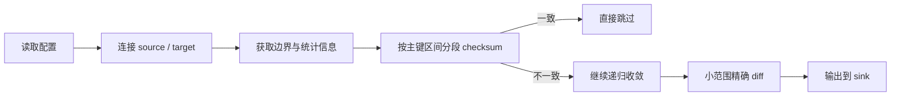

>导 读: 
      Consilens 是一个开源的跨数据源数据一致性校验工具，面向数据库迁移、数据同步、ETL、回填及双写等场景，提供一套可复用的工程化校验能力。它通过分段 checksum + 递归收敛的方式，在保证大表校验成本可控的前提下，逐步定位到主键级、字段级差异，解决跨数据源难比、大表代价高、误报多、差异难定位以及结果难复用等问题，帮助团队将一次性脚本校验升级为稳定、可扩展的数据一致性校验体系。
>
>
>Github:
>https://github.com/datavane/consilens
>欢迎关注、Star、Fork，参与贡献

## Consilens 是什么
Consilens 是一个开源的跨数据源数据一致性校验工具，用来验证数据库迁移、数据同步、ETL、回填、双写或灰度切换后的结果是否一致，并在发现差异后继续定位到可处理的范围。

它不是为了替代所有临时脚本，而是希望把“数据一致性校验”这件反复发生、又容易写散的工作，做成一项可以复用的工程能力。

## 解决什么问题

很多团队最开始都会用脚本做校验：先比 `COUNT(*)`，再抽样，最后把两边数据拉出来逐行比。

小表、同库、一次性任务里，这样做没有问题。但一旦进入真实生产场景，脚本很快会碰到几个边界：

- **跨数据源难**：MySQL 到 PostgreSQL、MySQL 到 StarRocks、Oracle 到 Doris 这类链路，不能默认靠一个 `JOIN` 解决。
- **大表贵**：把整表拉回应用侧比较，会占用大量网络、内存和数据库资源。
- **误报多**：数值精度、时间时区、`NULL`、布尔值、字符串格式在不同数据库里可能不一样，需要先规范化再比较。
- **定位弱**：很多脚本只能告诉你“两边不一致”，但不能继续告诉你差异在哪些主键、哪些字段。
- **结果难复用**：今天打到控制台，明天要 JSON，后天要 CSV 或落表，脚本很容易越改越散。

Consilens 解决的就是这些问题：跨数据源可比、大表可控、差异可定位、结果可消费。

## 怎么工作

Consilens 默认推荐走 `checksum` 路径，而不是一开始就拉全量明细。

大致流程是：

1. 读取 YAML 配置，连接 source 和 target 两侧数据库；
2. 获取表边界、主键范围和基础统计信息；
3. 按主键区间切分，执行分段 checksum；
4. 一致的分段直接跳过；
5. 不一致的分段继续递归收敛；
6. 范围足够小时，默认拉取完整行做精确比对；宽表且差异稀疏时，也可以显式启用 `row-hash` 过滤；
7. 最后把结果输出到配置的 sink。



这条路径的好处是：大多数一致数据可以尽快排除，真正昂贵的明细比较只发生在小范围异常区间里。

## 核心特性

**跨数据源校验**  
Consilens 不要求两侧数据集位于同一个实例，也不要求两端数据源能互相访问。source 和 target 分别在各自数据源中完成本地计算，再由 Consilens 汇总比较结果。

**大表优先 checksum 收敛**  
默认使用 `checksum` 作为大表校验入口，通过分段摘要先判断哪些区间一致，哪些区间需要继续下钻，降低全量拉数成本。

**字段级差异定位**  
当 checksum 发现不一致后，Consilens 会继续收敛范围，并在小范围内做精确比对，尽量输出主键级、字段级差异。默认模式会直接拉取完整行；如果明确启用 `row-hash`，则会先用主键 + 行哈希过滤，再回查差异键。

**多格式结果输出**  
结果输出通过 sink 解耦，当前支持 `console`、`json`、`csv`、`table`。你可以本地排查时看控制台，也可以把差异明细输出成文件或接入后续流程。

**连接器插件支持**  
数据源之间真正复杂的不是 JDBC URL，而是方言、类型格式化、时间函数、`NULL` 处理和元数据查询。Consilens 通过插件机制隔离这些差异，便于扩展新的数据库类型。

## 支持哪些数据库

当前已经完成端到端验证的是：

- MySQL
- PostgreSQL
- StarRocks

已内置的待验证连接器模块：

- SQL Server
- Oracle
- ClickHouse
- Doris
- Presto
- Trino
- TiDB


## 快速上手

使用 Consilens 的最小路径很短：生成配置并修改，执行 diff。

先生成配置模板：

```bash
./bin/consilens-cli.sh config generate -o config.yaml
```

配置里最关键的是这几部分：

```yaml
source:
  type: mysql
  connection:
    url: jdbc:mysql://localhost:3306/database1
    username: user1
    password: password1
  resource:
    type: table
    name: table1
target:
  type: mysql
  connection:
    url: jdbc:mysql://localhost:3306/database2
    username: user2
    password: password2
  resource:
    type: table
    name: table2
comparison:
  keys:
    source:
      - id
    target:
      - id
  fields:
    source:
      - name
      - email
      - status
    target:
      - name
      - email
      - status
strategy:
  mode: checksum
  algorithm: concat
  bisectionFactor: 4
  bisectionThreshold: 10000
  batchSize: 1000
  enableProfiling: false
result:
  sinks:
    - format: console
      type: result
    - format: json
      type: diff-record
      properties:
        path: ./diff-results.json
        pretty: true


```
对配置进行修改，然后执行比对：

```bash
./bin/consilens-cli.sh diff -c config.yaml
```

对于迁移验收、同步核对、回填验证这类场景，通常只需要一个发行包、一份 YAML 配置和一条 `diff` 命令，就可以把一次数据校验跑起来。

## 适合什么场景

Consilens 更适合这些场景：

- 数据库迁移前后的验收校验；
- CDC、ETL、回填任务的结果核对；
- 双写、灰度切换期间的周期性对账；
- 需要把差异结果接入文件、审计或后续流程的场景。

它也有清晰边界：

- 同库内的小范围核对，直接 `JOIN` 可能更高效；
- 规模很小、一次性的临时任务，脚本可能已经足够；
- 当前推荐默认路径是 `checksum`，`join` 更适合同一个 JDBC URL 下的直接核对。

## 为什么开源 Consilens

因为数据一致性校验在数据工程里太常见，也太容易被低估。

每一次迁移、切流、同步，都要面对同一个问题：**任务执行完了，但结果能不能信？**

如果这件事始终依赖一次性脚本，团队拿到的往往只是当下的答案；

如果它被沉淀成一套可重复执行、可扩展、可进入正式流程的工程能力，团队拿到的才是长期确定性。

Consilens 想做的，**就是把这件重要但容易被写散的工作，变成一套稳定、可复用、贴近生产环境的数据一致性校验框架。**
