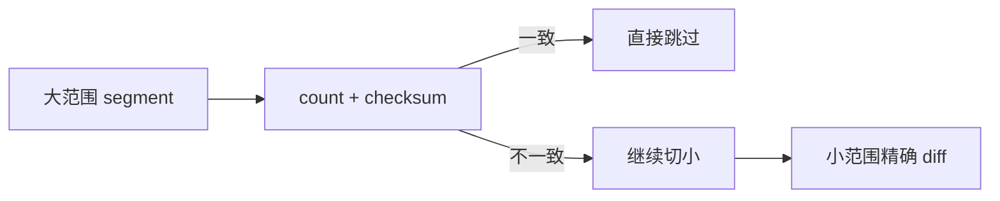
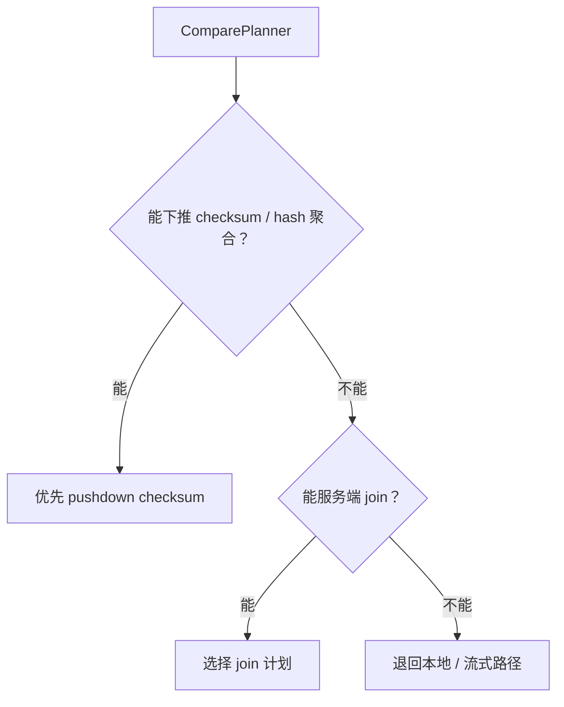
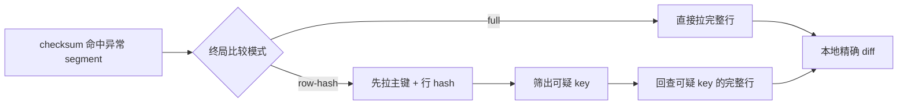
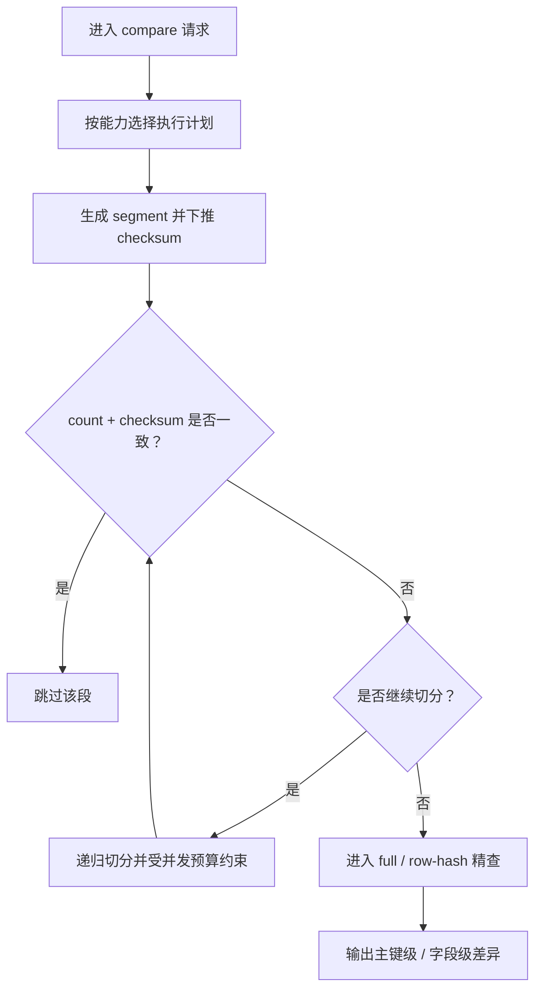

>导 读: 
      本文从架构设计视角拆解 Consilens checksum 模式：面对跨库、跨机房、大规模数据一致性校验，为什么不能简单全量拉取比较，而要采用“数据库端摘要计算、主键空间递归切片、本地精确比对”的设计。文章重点分析执行计划选择、分段策略、字段标准化、checksum 判断、递归收敛和资源控制等核心技术决策，帮助读者建立对 Consilens 大表校验机制的整体理解。
>
>
>Github:
>https://github.com/datavane/consilens
>欢迎关注、Star、Fork，参与贡献

# 跨源大表一致性校验的工程取舍

在小数据量场景里，一致性校验很简单：

```sql
SELECT * FROM source_table;
SELECT * FROM target_table;
```

然后在应用侧逐行比较。

但当数据规模进入千万级、亿级，或者 source / target 分布在不同数据库、不同机房、不同网络链路时，问题就变了。

此时真正的瓶颈通常不是 diff 算法本身，而是：

```text
数据传输成本
数据库查询压力
应用侧内存占用
长任务失败恢复
跨数据库类型差异
```

所以 Consilens checksum 模式的核心目标不是“写一个更快的逐行比较器”，而是：

> 在不牺牲最终行级差异定位能力的前提下，尽可能减少原始数据搬运。

这句话是整个设计的出发点。

---

## 一、整体策略：先在数据库端做摘要过滤，再对可疑区域精查

Consilens checksum 的执行链路可以抽象成四个阶段：

1、

这不是一个简单的 checksum 校验。

它本质上是一个**递归收敛算法**：

```text
大范围摘要一致  ->  直接跳过
大范围摘要不一致 ->  继续切小
小范围仍不一致  ->  拉明细做精确 diff
```



这种设计的关键在于：

> checksum 不是最终答案，而是过滤器。

最终仍然要落到行级差异，只是不会一开始就把全表搬回来。

---

## 二、核心设计一：基于能力而不是数据库类型选择执行计划

Consilens 的执行计划不是简单写死为：

```text
MySQL      -> checksum
PostgreSQL -> checksum
Oracle     -> local diff
```

而是由 `DefaultComparePlanner` 根据数据源能力选择策略。

2、

这个决策非常重要。

因为 Consilens 面向的是“跨源”，不是单一数据库。

所以 planner 不应该问：

```text
你是不是 MySQL？
```

而应该问：

```text
你能不能在服务端完成 hash 聚合？
你能不能在服务端完成 join？
你能不能下推过滤条件？
```



这让整个架构更容易扩展到新的数据源。

新增一个连接器时，核心问题不是改 planner，而是让连接器声明自己的能力，并实现对应 SQL 生成逻辑。

---

## 三、核心设计二：按主键空间切片，而不是按 offset 分页

大表比对最容易想到的是分页：

```sql
LIMIT 10000 OFFSET 0;
LIMIT 10000 OFFSET 10000;
LIMIT 10000 OFFSET 20000;
```

但 offset 分页在大表场景里问题很多：

```text
越往后越慢
数据变化时不稳定
不同数据库执行代价差异大
不适合递归收敛
```

Consilens 选择的是基于主键范围的 segment：

```text
[minKey, maxKey)
```

例如：

```text
[1000, 2000)
[2000, 3000)
[3000, 4000)
```

这背后有三个技术原因。

第一，范围条件更容易利用索引。

```sql
WHERE id >= 1000 AND id < 2000
```

第二，半开区间天然避免重叠和漏数。

第三，递归切分时可以继续保持同一套边界语义。

3、

所以，`TableSegment` 不是一个普通分页对象，而是 checksum 递归算法里的基本执行单元。

---

## 四、核心设计三：checksum 必须建立在标准化之后

跨库一致性校验不能直接对数据库原始值做 hash。

因为同一个业务值，在不同数据库里的物理或文本表达可能不同。

例如：

| 类型 | 可能差异 |
| --- | --- |
| CHAR / VARCHAR | 尾部空格、字符集、排序规则 |
| DECIMAL | 精度、scale、尾零 |
| TIMESTAMP | 时区、格式、毫秒精度 |
| JSON | 字段顺序、存储格式 |
| BLOB | 二进制展示形式 |

所以 Consilens 在生成 checksum SQL 时，会通过 `DataTypeHandler.normalizeColumn()` 对字段做标准化。

整体逻辑是：

4、

这意味着 Consilens 比较的不是“数据库底层字节”，而是“标准化后的语义值”。

这是 checksum 能跨数据库成立的前提。

否则 checksum 只会把大量格式差异误判成数据差异。

---

## 五、核心设计四：count + checksum 双条件判断

一个 segment 是否可以跳过，不只看 checksum。

Consilens 使用的是：

```text
source.count == target.count
AND
source.checksum == target.checksum
```

只有两个条件都满足，才认为该 segment 一致。

5、

这个判断看起来简单，但很关键。

checksum 是摘要，摘要天然存在碰撞概率。

count 不能消除所有碰撞，但它能提供另一个独立信号，过滤掉大量明显不一致的情况。

这是一种很典型的工程设计：

> 不追求单点绝对可靠，而是组合多个低成本信号，提高整体判断可靠性。

---

## 六、核心设计五：大段多路切，小段二分，最终本地精查

递归切分不是永远二分，也不是永远按固定 fan-out 切。

Consilens 当前策略可以理解为：

```text
大范围：多路切分，提高收敛速度
中等范围：继续缩小问题区域
小范围：停止递归，进入本地精确比较
```

这里的核心不是“切得越细越好”。

切分本身也有成本：

```text
更多 SQL 查询
更多异步任务
更多数据库连接占用
更多调度开销
```

所以 Consilens 需要在两件事之间做平衡：

```text
继续切分，减少明细拉取
提前本地比较，减少递归开销
```

这也是 `bisectionThreshold`、`bisectionFactor`、`maxDepth`、`activeSegmentBudget` 这些参数存在的意义。

---

## 七、核心设计六：终局比较有 full 和 row-hash 两种路径

checksum 只能告诉我们某个范围存在差异。

但最终用户需要的是：

```text
哪一行缺失？
哪一行多出？
哪一行字段不一致？
具体哪几个字段不同？
```

所以最终必须进入本地精确比较。

当前有两种模式。

### 1. full 模式

直接拉取小 segment 内的完整行：

```text
source full rows
target full rows
local diff
```

优点：

```text
实现简单
结果直观
排障容易
```

缺点：

```text
宽表场景下传输量较大
低差异率时会拉取很多无差异数据
```

### 2. row-hash 模式

先只拉主键和行级 hash：
7、

适合：

```text
宽表
差异行很少
网络成本敏感
```

这是一个典型的两阶段优化：

```text
先用轻量行摘要定位可疑 key
再只对可疑 key 回查完整数据
```



---

## 八、核心设计七：用并发预算约束递归任务树

递归算法如果不加控制，很容易把问题从“数据比较”变成“任务爆炸”。

例如一个大 segment 被切成 32 个子 segment，每个子 segment 又继续切分，任务数量会迅速扩大。

所以 Consilens 引入了类似 `activeSegmentBudget` 的约束。

8、

这个设计说明 Consilens 并不是单纯追求算法上的最优切分，而是在考虑真实运行环境：

```text
数据库连接数有限
线程池容量有限
查询队列有限
系统需要可控退化
```

真正可上线的校验系统，必须能控制自己的资源边界。

---

## 九、整体技术决策图

可以把 Consilens checksum 模式总结成下面这张技术决策图：

9、

这张图比单纯讲 checksum 算法更重要。

因为它表达的是整个系统的工程判断：

```text
什么时候下推？
什么时候跳过？
什么时候继续切？
什么时候停止递归？
什么时候拉明细？
什么时候控制并发？
```



这些决策共同构成了 Consilens checksum 模式的设计核心。


## 加入我们
Consilens 的目标是成为最好的跨数据源数据一致性比对的开源项目，为更多的用户去解决数据一致性校验中遇到的问题。在此我们真诚欢迎更多的贡献者参与到社区建设中来，和我们一起成长，携手共建更好的社区。

**项目地址：**
https://github.com/datavane/consilens
**问题和建议：**
https://github.com/datavane/consilens/issues
**贡献代码：**
https://github.com/datavane/consilens/pull
