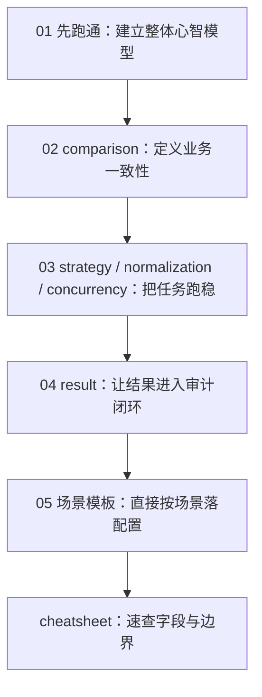

# Consilens 配置实战系列

很多工具的文档会把参数一项一项列出来。这样的文档当然完整，但对真正要落地的人来说，往往还差一步：**我手上这个数据校验需求，到底应该怎么配？为什么这么配？后面出了问题又该从哪里排查？**

这套文章就是为了解决这个问题。

我会把 Consilens 的配置能力放回真实的数据一致性场景里来讲：从第一次跑通两张表的核对，到跨库字段对齐、类型标准化、结果落库审计，再到生产环境里的性能调优和场景化模板。你不需要先把所有字段背下来，只要顺着场景往下走，就能逐步形成自己的配置判断力。

## 建议阅读顺序

1. **01-先跑通，再理解：从一份配置看懂 Consilens.md**  
   先建立完整心智模型：两端数据从哪里来，比什么，怎么比，结果去哪里。

2. **02-真正决定准不准的是 comparison.md**  
   主键、比较字段、过滤条件、字段映射、排障上下文都在这一层。这里讲清楚了，误报会少很多。

3. **03-让任务跑得稳：strategy、normalization 与 concurrency.md**  
   讲 checksum 和 join 怎么选，跨库类型差异怎么消噪，大表任务如何逐步调优。

4. **04-结果不是终点：result 与审计闭环.md**  
   控制台、JSON、CSV、结果表、差异明细表各自适合什么场景，如何让对账结果进入治理流程。

5. **05-七个常见场景，直接拿去改.md**  
   把最常见的使用方式整理成模板。读完前五篇后，这一篇会变成你的日常配置起点。

6. **06-配置速查.md**  
   一页速查。适合已经理解整体思路后，快速确认字段和边界。

## 这套文章适合谁

- 第一次接触 Consilens，希望尽快跑通一个对账任务的人；
- 正在做数据迁移、数仓同步、湖仓建设，需要校验两端数据一致性的人；
- 已经能写配置，但经常被字段差异、时间精度、布尔值、结果落库、性能问题困扰的人；
- 想把 Consilens 接入生产治理、审计、告警链路的人。

## 一句话理解 Consilens 配置

一份好的 Consilens 配置，本质上是在回答五个问题：

1. 我要比较哪两份数据？
2. 哪些记录在业务上算同一条？
3. 哪些字段真正决定一致性？
4. 用什么方式更稳、更快地完成比较？
5. 差异结果要给谁看、落到哪里、如何追踪？

后面的所有参数，都是围绕这五个问题展开的。
