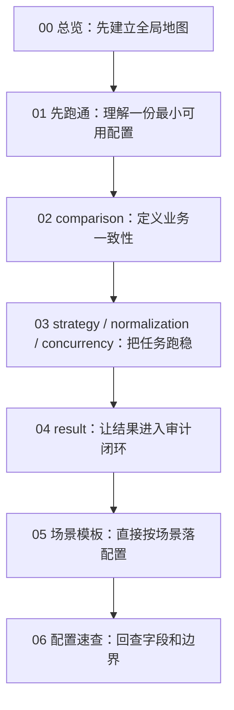

# 00｜Consilens 配置讲解总览：从第一次跑通到生产治理闭环

> 导读：
> 本文是一篇面向实战的总览稿，用来回答一个最常见的问题：Consilens 的配置文档看起来并不复杂，但真正落到跨库、跨机房、大表一致性校验、结果落库和生产调优时，到底应该先看什么、后看什么、出了问题又该回到哪一层排查。全文会把整套“配置讲解”文章的阅读路径、核心问题和适用场景串起来，帮助你先建立全局地图，再进入具体配置细节。
>
> Github:
> https://github.com/datavane/consilens
> 欢迎关注、Star、Fork，参与贡献

很多工具的文档，参数写得很全，但真正落地时，使用者脑子里最常见的问题其实不是“这个字段叫什么”，而是：

- 我手上这个校验需求，到底该从哪一层开始配？
- 为什么明明跑通了，结果却不准？
- 为什么规则看起来没问题，一上生产就慢、就抖、就不好排障？
- 一次 diff 跑完以后，结果到底应该怎么沉淀，才能真正进入治理闭环？

这篇总览，就是给这几个问题准备的。

它不是参数手册，也不是 API 索引，而是一张**配置地图**：帮你先看清 Consilens 的配置体系到底在解决什么问题，再决定应该进入哪一篇细看。

## 先记住：一份 Consilens 配置，本质上在回答五个问题

如果只用一句话理解 Consilens 配置，可以记住下面这条主线：

1. **我要比较哪两份数据？**
2. **哪些记录在业务上算同一条？**
3. **哪些字段真正决定一致性？**
4. **用什么方式更稳、更快地完成比较？**
5. **差异结果给谁看、落到哪里、怎么追踪？**

你会发现，后面所有配置项几乎都能被放回这五个问题里：

- `source / target` 解决“从哪里取数”；
- `comparison` 解决“什么叫一致”；
- `strategy / normalization / concurrency` 解决“怎样跑得准、跑得稳、跑得动”；
- `result` 解决“结果怎样进入排障和治理链路”。

所以，与其把配置当成一堆字段，不如把它看成一次完整的数据一致性设计。

## 这套文章的阅读主线

这一套顺序不是按“参数字母表”排的，而是按真实项目最自然的落地路径排的：

- 先能跑起来；
- 再把口径定义准确；
- 然后把任务跑稳；
- 再把结果沉淀下来；
- 最后把常见场景模板化、把字段边界速查化。

## 如果你时间不多，可以这样选读

| 你的当前问题 | 建议先看 |
| --- | --- |
| 第一次接触 Consilens，不知道一份配置怎么拼起来 | **01** |
| 任务跑出来很多误报，不知道是 keys、fields 还是 filters 的问题 | **02** |
| 大表任务太慢、跨库误报多、并发不好调 | **03** |
| 想把结果落库、进告警、进工单、进治理系统 | **04** |
| 已经理解原理，只想拿一份可改的模板快速开工 | **05** |
| 已经在落地中，只想随手查字段和边界 | **06** |

如果你是第一次完整读这套文章，还是建议按 01 → 06 走一遍。这样后面遇到问题时，你能知道自己是在“数据集定义层”“业务口径层”“执行策略层”还是“结果输出层”出了偏差。

## 每一篇文章分别解决什么问题

### 01｜先跑通，再理解：从一份配置看懂 Consilens

这一篇解决的是**“我怎么先写出第一份能跑的配置”**。

它会从一份最小但完整的例子出发，把 `source / target`、`comparison`、`strategy`、`result` 四块拆开讲，让你先建立基本心智模型。对于第一次上手的人来说，这一篇最重要的价值不是记住参数，而是明白：

> 一份配置不是在堆字段，而是在翻译一个真实的数据校验需求。

### 02｜真正决定准不准的是 comparison

这一篇解决的是**“为什么任务能跑，但结果不准”**。

大多数误报，根因不在算法，而在 `comparison` 没有把业务一致性说清楚。主键选错、字段口径不一致、过滤边界不一致、两边字段语义不对齐，都会把后面的执行链路带偏。

所以这一篇会重点讲清楚：

- `keys` 怎么选；
- `fields` 和 `exclude` 怎么分工；
- `filters` 为什么不是随手加条件；
- `mappings` 什么时候该用；
- `extraColumns` 更适合承担什么角色。

### 03｜让任务跑得稳：strategy、normalization 与 concurrency

这一篇解决的是**“为什么任务一上生产就不稳”**。

很多任务不是不会跑，而是：

- 跨库精度和格式不一致，误报很多；
- 大表 checksum 虽然快，但分段、批量和并发调不好；
- 网络、数据库、CPU 的瓶颈混在一起，看起来哪都像问题。

这一篇会把 `strategy`、`normalization`、`concurrency` 放回真实运行场景里解释，告诉你什么情况下该选什么路径、什么情况下先调标准化、什么情况下应该先收敛范围而不是先加并发。

### 04｜结果不是终点：result 与审计闭环

这一篇解决的是**“任务跑完之后，结果怎么真正有用”**。

如果对账结果只停留在控制台里，那它最多只是一次性检查；只有当结果能进入 JSON、结果表、差异明细表，进一步进入告警、工单、治理看板和回放链路时，它才真正变成生产体系里的一个节点。

所以这一篇会重点回答：

- console / json / table sink 分别适合什么场景；
- 结果摘要和差异明细该怎么配合；
- 默认结构和自定义结构的边界在哪里；
- 怎样从试跑阶段逐步演进到生产化结果沉淀。

### 05｜七个常见场景，直接拿去改

这一篇解决的是**“我已经理解了，现在给我一份能改的模板”**。

它把最常见的配置场景直接整理成模板，比如：

- 同构表全量核对；
- 忽略审计列；
- 字段映射对齐；
- SQL 资源比对；
- 按业务切片过滤；
- 按时间窗滚动检查；
- 结果落库与治理接入。

但它不是让你机械复制，而是让你快速找到最接近业务现状的起点，再去替换连接、主键、字段和结果链路。

### 06｜配置速查

这一篇解决的是**“我知道整体思路了，但现场需要快速确认边界”**。

它适合在你已经跑过任务、也理解配置分层之后使用。相比前面几篇，它更像一本口袋手册：帮你快速回忆某一类字段该放在哪一层、某个参数更适合承担什么职责、出现某类问题应该优先回查哪里。

## 这套文章适合谁

如果你属于下面任意一种情况，这套内容都会比较对路：

- 第一次接触 Consilens，希望尽快跑通一个对账任务；
- 正在做数据迁移、数仓同步、湖仓建设，需要校验两端数据一致性；
- 已经能写基础配置，但经常被误报、类型差异、结果落库、性能调优卡住；
- 想把 Consilens 接进生产环境里的治理、审计、告警链路。

## 读完这套文章，你应该得到什么

理想状态下，读完这套系列，你不只是“知道字段怎么写”，而是会形成下面这套判断顺序：

1. 先定义数据集，而不是先纠结数据库类型；
2. 先定义业务一致性，再谈执行优化；
3. 先判断问题在哪一层，再决定调什么参数；
4. 先让结果可排障，再让结果可治理；
5. 先从稳定模板起步，再逐步抽象成团队规范。

这套判断顺序，比记住某一个字段默认值更重要。

## 建议你从哪里开始

如果你现在还没写出第一份配置，就从 **01** 开始。

如果你已经跑过任务，但总觉得结果“不太对”，直接去看 **02**。

如果你已经在生产里跑 checksum 或 join 任务，最值得反复回看的通常是 **03** 和 **04**。

如果你只想尽快把今天手头的需求落地，先去 **05** 找最接近的模板，再回头补读前面的原理篇。

这也是这篇总览真正想做的事：不是替代后面的文章，而是帮你在进入细节之前，先知道**该往哪里走**。
