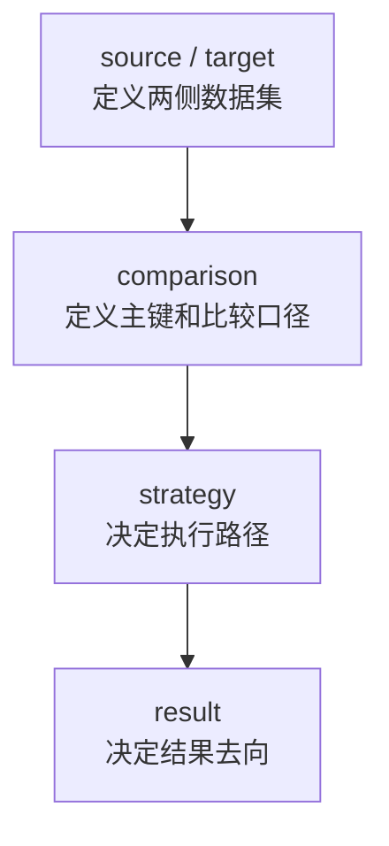
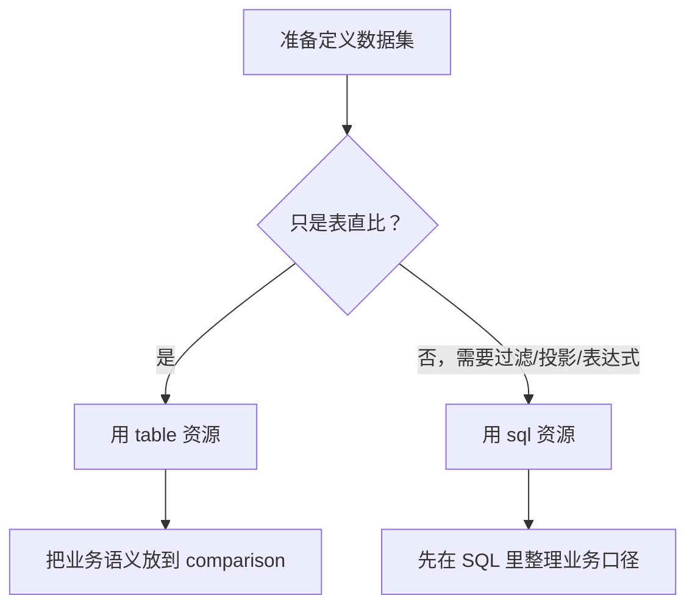
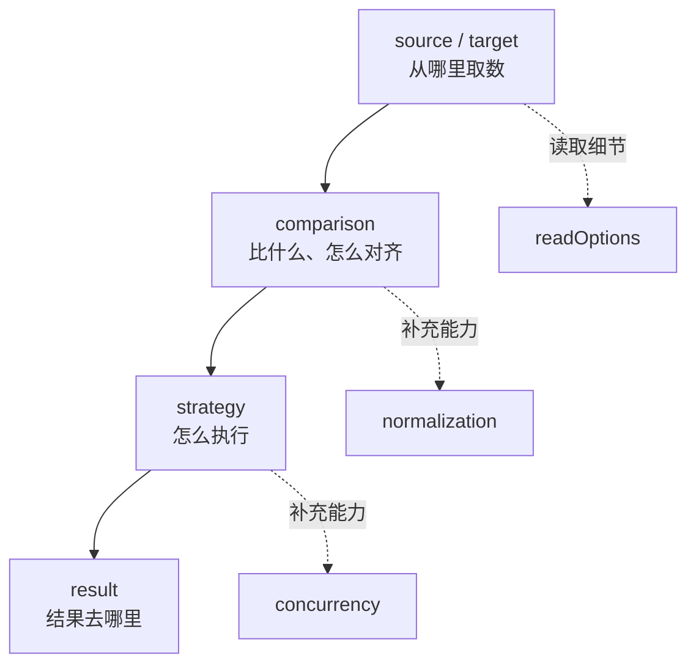

# Consilens 配置系列｜ 基础配置讲解 

> 导读：
> 本文从“先跑通、再拆解”的视角讲清 Consilens 的基础配置结构：如何从一份最小可用配置出发，理解 `source / target`、`comparison`、`strategy`、`result` 这四个核心配置块分别负责什么，以及怎样把一个真实对账需求翻译成一份能执行、能排障、能继续扩展的配置。
>
> Github:
> https://github.com/datavane/consilens
> 欢迎关注、Star、Fork，参与贡献


学习一个配置型工具，最怕一上来就掉进字段细节里，Consilens 也是一样。你当然可以从 `source.type`、`comparison.keys`、`strategy.mode` 一个个字段看下去，但这样很容易看完一圈之后仍然不知道：**我到底该怎么把一个真实的对账需求翻译成配置？**

更好的方式，是先看一份最小但完整的配置，然后把它拆开。

## 一份最常见的表对表核对

假设我们要校验 MySQL 里的订单源表和 PostgreSQL 里的订单明细表是否一致，可以先写成这样：

```yaml
source:
  type: mysql
  name: order-source
  connection:
    url: jdbc:mysql://localhost:3306/ods
    username: root
    password: 123456
  resource:
    type: table
    name: ods_order

target:
  type: postgresql
  name: order-target
  connection:
    url: jdbc:postgresql://localhost:5432/dwd
    username: postgres
    password: 123456
  resource:
    type: table
    name: dwd_order

comparison:
  keys:
    source:
      - order_id
    target:
      - order_id
  fields:
    source:
      - buyer_id
      - amount
      - order_status
      - updated_at
    target:
      - buyer_id
      - amount
      - order_status
      - updated_at

strategy:
  mode: checksum
  algorithm: xor

result:
  sinks:
    - format: console
      type: result
```

这份配置并不复杂，但它已经把 Consilens 的工作方式讲完了。



- `source` 和 `target`：我要比较哪两份数据；
- `comparison`：怎样把两侧记录对齐，哪些字段需要判断一致；
- `strategy`：用什么方式执行比较；
- `result`：结果输出到哪里。

先抓住这四块，后面再看任何高级能力都不会乱。

## source / target：确定要比对的数据集

很多人第一次写配置时，会把 `source` 和 `target` 理解成“左边数据库”和“右边数据库”。这没错，但还不够准确。

在 Consilens 里，`source` 和 `target` 更应该理解成两份**待比较的数据集**。这份数据集可以是一张表，也可以是一段 SQL 组织出来的业务视图。

最常见的是表：

```yaml
source:
  type: mysql
  connection:
    url: jdbc:mysql://localhost:3306/ods?useSSL=false&serverTimezone=UTC
    username: root
    password: 123456
  resource:
    type: table
    name: ods_order
```

这里真正值得注意的是 `resource`。

当 `resource.type: table` 时，`resource.name` 就是表名。连接信息放在 `connection` 里，JDBC URL、用户名、密码是最常见的三件套。除此之外，连接器需要的其他属性也可以继续写在 `connection` 下，例如 PostgreSQL 的 `currentSchema`、应用名等。

```yaml
source:
  type: postgresql
  connection:
    url: jdbc:postgresql://localhost:5432/bh
    username: postgres
    password: 123456
    currentSchema: public
    applicationName: consilens
```

这些扩展属性会交给连接器处理。也就是说，Consilens 不强行替你抽象掉所有数据库细节，而是给你保留必要的控制权。

## 表不合适时，就把 SQL 当成业务视图

真实项目里，两边数据很少永远长得一模一样。

比如源端叫 `status`，目标端叫 `order_status`；源端要过滤逻辑删除，目标端要过滤归档状态；或者两边都需要先做一次投影再比较。这个时候，不要急着把所有逻辑都塞进 `comparison`，更自然的办法是把数据集直接定义成 SQL。

```yaml
source:
  type: mysql
  connection:
    url: jdbc:mysql://localhost:3306/ods
    username: root
    password: 123456
  resource:
    type: sql
    path: |
      SELECT
        order_id,
        buyer_id,
        amount,
        status AS order_status,
        updated_at
      FROM ods_order
      WHERE deleted = 0

target:
  type: postgresql
  connection:
    url: jdbc:postgresql://localhost:5432/dwd
    username: postgres
    password: 123456
  resource:
    type: sql
    path: |
      SELECT
        order_id,
        buyer_id,
        total_amount AS amount,
        order_status,
        updated_at
      FROM dwd_order
      WHERE is_deleted = false
```

这里的 `resource.path` 放的是 SQL 文本，不是文件路径。当前版本要求它以 `SELECT` 或 `WITH` 开头，不要带分号，也不要写 SQL 注释。

我的建议很简单：



- 如果你要比较的是物理表，而且只是轻量字段对齐，用表资源；
- 如果你要比较的是一个业务口径，尤其需要过滤、投影、改名、表达式计算，用 SQL 资源。

这个选择会直接影响后面配置是否清爽。

## name：它不参与比较，但有助于排错

`source.name` 和 `target.name` 不是必填项。很多示例里为了简短也会省略。

但只要任务会长期运行，我建议你写上。

```yaml
source:
  name: order-source

target:
  name: order-target
```

它不会改变比较结果，却会出现在日志、任务标识、结果追踪这些地方。生产排障时，一个清晰的名字往往比你想象中更重要。

配置不是只给机器读的，也是给后面接手的人读的。

## comparison：真正的业务语义从这里开始

`source` 和 `target` 解决的是“从哪里取数”，`comparison` 解决的是“怎样才算相同”。

最基本的写法是：

```yaml
comparison:
  keys:
    source:
      - order_id
    target:
      - order_id
  fields:
    source:
      - col_int
      - col_decimal
      - amount
      - status
      - updated_at
    target:
      - col_int
      - col_decimal
      - amount
      - status
      - updated_at
```

这里有两个概念要分清。

`keys` 是业务主键。Consilens 会先用它判断两边哪两条记录应该放在一起比较。它必须配置，而且两侧数量要一一对应。

`fields` 是一致性字段。也就是当两边找到同一条记录以后，哪些字段需要逐个判断是否相同。

如果两边结构非常接近，你也可以不写 `fields`：

```yaml
comparison:
  keys:
    source:
      - id
    target:
      - id
```

这时系统会默认比较所有非主键列。这个写法适合初次全量核对，尤其是同构表迁移之后想快速看差异全貌。

## strategy：先求稳，再谈快

Consilens 当前最常用的策略是 `checksum`。

```yaml
strategy:
  mode: checksum
  algorithm: xor
```

对于跨库、大表、链路复杂的场景，`checksum` 是更稳妥的默认选择。它不是简单把两边数据全部拉回来硬比，而是通过校验和、分段、局部比较等机制逐步缩小差异范围。

还有一种策略是 `join`：

```yaml
strategy:
  mode: join
  algorithm: concat
```

`join` 适合同域、同实例、数据库端能直接完成 Join 的情况。它可能很快，但边界也更明确。只要你不确定两边是否能在数据库侧自然 Join，就不要把它当成默认选项。

一句话：

> 跨库和生产任务，优先 checksum；明确同域可 Join，再考虑 join。

## result：不要让差异只停在控制台

最初试跑时，控制台输出足够了。

```yaml
result:
  sinks:
    - format: console
      type: result
```

但到了生产环境，一次对账的价值不只是“跑完了”。你通常还需要回答：差异有多少？哪类差异最多？明细能不能落库？后续能不能接告警、工单、治理看板？

所以 `result` 支持多个 sink：

```yaml
result:
  failOnSinkError: true
  sinks:
    - format: console
      type: result

    - format: json
      type: diff-record
      properties:
        path: ./output/diff-${taskId}.json
        pretty: true

    - format: table
      type: diff-record
      properties:
        type: postgresql
        url: jdbc:postgresql://localhost:5432/audit
        username: postgres
        password: 123456
        tableName: diff_result_detail
        createTable: true
        batchSize: 1000
```

这就是从“工具试跑”走向“治理闭环”的关键一步。

## 先记住这张心智图

一份 Consilens 配置，可以按这条线来读：



后面所有高级配置，都是在这条主线上补能力：

- `normalization`：解决跨库类型语义不一致；
- `concurrency`：解决大任务的并发和吞吐；
- `readOptions`：解决数据读取链路的细节控制。

掌握这条主线后，你再回头看字段，就不会觉得它们是一堆散乱参数，而是一套围绕数据一致性展开的工程语言。
