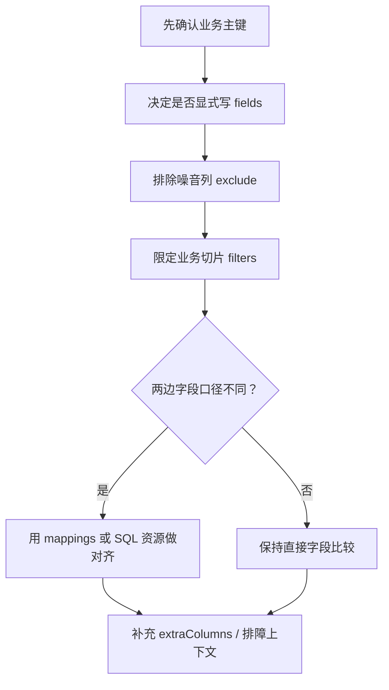

# 02｜真正决定准不准的是 comparison

> 导读：
> 本文聚焦 Consilens 里最决定“比得准不准”的 `comparison` 配置，重点解释 `keys`、`fields`、`exclude`、`filters`、`mappings`、`extraColumns` 分别在业务一致性定义里承担什么角色，以及如何把主键口径、字段语义、过滤边界和对齐规则表达清楚，避免把误报带进后续执行链路。
>
> Github:
> https://github.com/datavane/consilens
> 欢迎关注、Star、Fork，参与贡献

很多数据对账任务跑不准，并不是算法不行，而是“比什么”没有讲清楚。

两张表看起来像是同一份业务数据，但主键口径可能不同，字段名可能不同，过滤边界可能不同，时间字段和审计字段还可能天然不一致。如果这些问题没有在 `comparison` 里表达清楚，后面的策略再高级，也只是在更快地产生误报。

所以这一篇只讲一件事：怎样把业务一致性翻译成 Consilens 能执行的比较规则。

## keys：先找到同一条业务记录

Consilens 不是把两边数据拿来整行盲比。它会先根据主键找到“同一条业务记录”，然后再判断字段是否一致。

因此 `comparison.keys` 是必填项。

```yaml
comparison:
  keys:
    source:
      - order_id
    target:
      - order_id
```

如果业务主键是复合主键，也直接写成数组：

```yaml
comparison:
  keys:
    source:
      - order_id
      - item_id
    target:
      - order_id
      - item_id
```

这里有一个朴素但非常重要的判断标准：

> keys 不一定是数据库物理主键，但必须能在业务上稳定定位一条记录。

如果 keys 选错了，后面会出现两类典型问题：

- 本来是同一条记录，却对不起来，变成源缺失或目标缺失；
- 本来是多条业务记录，却被错误合并，导致差异判断失真。

所以写 Consilens 配置时，第一件事不是填连接串，而是问清楚：这份数据的业务主键是什么。

## fields：只把真正关心的列放进一致性判断

`fields` 决定同一条记录对齐之后，哪些字段需要判断一致。

```yaml
comparison:
  keys:
    source:
      - order_id
    target:
      - order_id
  fields:
    source:
      - buyer_id
      - amount
      - order_status
      - pay_time
    target:
      - buyer_id
      - amount
      - order_status
      - pay_time
```

这个配置适合大多数生产场景。因为生产里的表通常有很多辅助字段：创建时间、更新时间、同步批次、写入时间、来源系统、扩展字段。它们对排障有用，但不一定应该决定“业务是否一致”。

我的经验是：

- 财务、订单、库存这类强一致场景，`fields` 要显式写；
- 初次迁移核对、同构表全列扫描，可以先省略 `fields` 看全貌；
- 一旦进入稳定任务，最好把真正关心的字段收敛下来。

## 不写 fields：默认比较所有非主键列

如果两边结构接近，可以只写主键：

```yaml
comparison:
  keys:
    source:
      - id
    target:
      - id
```

这时 Consilens 会比较所有非主键列。

这不是偷懒，而是一个很实用的阶段性策略。比如你刚做完一批表迁移，还不知道差异主要在哪里，可以先全列比较，把问题面打开。等差异类型看清楚后，再把不该参与一致性判断的列排除出去。

## exclude：把噪音列拿掉

真实系统里，总会有一些字段不适合比较。最常见的是：

- `created_at`、`updated_at`；
- `sync_time`、`batch_id`；
- CDC offset、写入版本号；
- 由目标端重新生成的审计字段。

这时可以使用 `exclude`：

```yaml
comparison:
  keys:
    source:
      - id
    target:
      - id
  exclude:
    source:
      - created_at
      - updated_at
      - sync_time
    target:
      - created_at
      - updated_at
      - sync_time
```

`exclude` 在省略 `fields` 时特别有用。你可以先让系统比较所有非主键列，再明确排除那些已知噪音字段。

但不要把 `exclude` 当成长期掩盖问题的工具。如果一个字段总是产生差异，要么它确实不属于一致性口径，要么你的同步链路或标准化规则有问题。前者用 `exclude`，后者应该去修配置或链路。

## filters：比较一个业务切片

不是每一次校验都要扫完整张表。很多对账任务只关心某一天、某个租户、某个业务状态。

```yaml
comparison:
  keys:
    source:
      - order_id
    target:
      - order_id
  fields:
    source:
      - col_int
      - col_decimal
      - amount
      - status
      - updated_at
    target:
      - col_int
      - col_decimal
      - amount
      - status
      - updated_at
  filters:
    source: "dt = '2026-05-05' AND tenant_id = 1001"
    target: "dt = '2026-05-05' AND tenant_id = 1001"
```

这里最容易犯的错误，是只给一边加过滤条件，或者两边条件看起来相似但业务边界不同。

我的建议是把 `filters` 当成“对账合同”的一部分：

- 要么两边都写；
- 要么两边都不写；
- 写了就要确保它们表达的是同一个业务切片。

对账最怕的不是慢，而是左右两边比的根本不是同一批数据。

## mappings：字段不一样时，把它们投影成同一套逻辑字段

很多跨系统对账最麻烦的地方，不是数据不同，而是表达方式不同。

源端叫 `user_id`，目标端叫 `customer_id`；源端金额叫 `amount`，目标端叫 `total_amount`；源端时间要取 `DATE(created_at)`，目标端要取 `DATE(created_time)`。

这时可以用 `mappings`。

```yaml
comparison:
  keys:
    source:
      - order_id
    target:
      - id
  mappings:
    - name: order_id
      source:
        column: order_id
      target:
        column: id
      key: true

    - name: buyer_id
      source:
        column: user_id
      target:
        column: customer_id

    - name: order_amount
      source:
        column: amount
      target:
        column: total_amount

    - name: biz_date
      source:
        expression: "DATE(created_at)"
      target:
        expression: "DATE(created_time)"

```

你可以把 `mappings` 理解成一层“逻辑字段模型”。

- `name` 是逻辑字段名，也是结果里更容易读懂的字段名；
- `column` 表示直接取列；
- `expression` 表示用表达式做轻量投影；
- `literal` 表示给一个常量；
- `key: true` 表示这个逻辑字段承担主键角色；
- `compare: false` 表示这个逻辑字段不会进入比较字段集合，当前版本不要把它当成“自动随差异结果带出上下文”的能力来依赖。

这里有两个边界一定要记住。

第一，即使用了 `mappings`，`comparison.keys` 仍然要配置。`keys` 解决原始数据如何对齐，`mappings[*].key` 解决映射后的逻辑主键如何命名。

第二，`fields` 和 `mappings` 不要同时使用。一个是直接指定比较字段，一个是先投影出逻辑字段再比较。两条路选一条，配置会清楚很多。

## SQL 资源和 mappings 怎么选

如果你已经用了 `resource.type: sql`，很多字段改名和表达式处理其实可以直接写在 SQL 里。

```yaml
resource:
  type: sql
  path: |
    SELECT
      order_id,
      user_id AS buyer_id,
      DATE(created_at) AS biz_date,
      amount
    FROM ods_order
    WHERE deleted = 0
```

这种情况下，再叠一层复杂 `mappings` 反而会让排障变难。

我的实践建议是：

- 表资源 + 字段轻量对齐：用 `mappings`；
- SQL 资源 + 业务视图塑形：优先在 SQL 里完成；
- 复杂清洗、聚合、过滤：不要塞进 `mappings.expression`，应该放到 SQL 资源里。

`mappings.expression` 适合表达式，不适合承载一段复杂查询。

## extraColumns：把排障上下文带出来

有些字段不参与一致性判断，但差异发生时你很想看到它们。

比如 `tenant_id`、`updated_at`、`biz_date`、`source_system`。这些字段能帮助你定位问题，但它们未必应该作为比较字段。

```yaml
comparison:
  keys:
    source:
      - order_id
    target:
      - order_id
  fields:
    source:
      - amount
      - order_status
    target:
      - amount
      - order_status
  extraColumns:
    - tenant_id
    - updated_at
```

`extraColumns` 的定位很明确：

> 它服务于排障和结果上下文，不服务于一致性判断。

真正决定相等性的列，还是应该放在 `fields` 或 `mappings` 里。

补一句当前版本的边界：`extraColumns` 适合和 `fields` 搭配使用；如果你已经走 `mappings` 路径，就不要再假设 `extraColumns` 会被自动编译进逻辑比较列。

## 一个判断顺序

写 `comparison` 时，可以按这个顺序问自己：



1. 哪些字段能稳定定位一条业务记录？写进 `keys`。
2. 我是想全列比较，还是只比较核心业务字段？决定是否写 `fields`。
3. 有没有天然不该比较的噪音列？写进 `exclude`。
4. 这次只比较某个业务切片吗？写进 `filters`。
5. 两边字段名或表达式不同吗？考虑 `mappings` 或 SQL 资源。
6. 差异发生时还需要哪些上下文？放进 `extraColumns`。

只要这个顺序清楚，`comparison` 就不会变成参数堆砌，而会变成一份可读的业务一致性说明。
