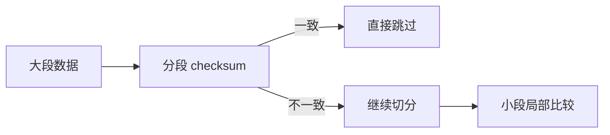
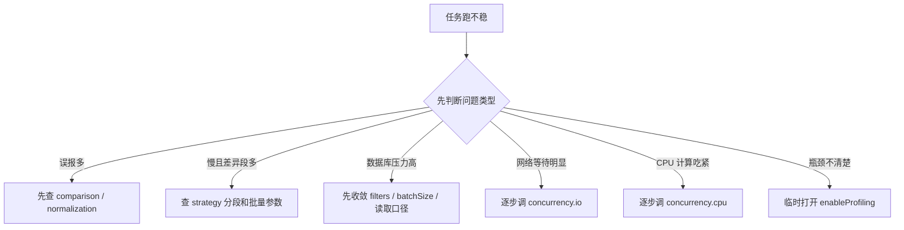

# 03｜让任务跑得稳：strategy、normalization 与 concurrency

> 导读：
> 本文从生产运行视角拆解 Consilens 任务稳定性的关键配置，重点说明 `strategy` 怎样决定比较路径，`normalization` 怎样消除跨库类型与格式差异，`concurrency` 怎样控制 CPU 与 I/O 并发预算，并给出一套更贴近真实场景的调优和排查顺序，帮助你把“能跑”变成“跑得稳”。
>
> Github:
> https://github.com/datavane/consilens
> 欢迎关注、Star、Fork，参与贡献

把 `comparison` 写清楚，解决的是“比得准”。

但在生产环境里，仅仅比得准还不够。大表要能跑得动，跨库要尽量少误报，任务跑慢时要知道从哪里调。这个时候就要看三块配置：`strategy`、`normalization` 和 `concurrency`。

它们分别回答三个问题：

- 用什么执行策略去比较？
- 不同数据库的类型差异怎么统一？
- 大任务怎么合理利用并发？

## strategy：先选一条正确的路

Consilens 当前公开的主要策略是 `checksum` 和 `join`。

很多人会问：哪一个更快？

我更建议先问：哪一个更适合你的数据环境？

## checksum：跨库和大表的默认选择

大多数时候，你应该从 `checksum` 开始。

```yaml
strategy:
  mode: checksum
  algorithm: xor
  bisectionFactor: 4
  bisectionThreshold: 20000
  batchSize: 2000
  enableProfiling: false
  localCompare:
    mode: full
```

`checksum` 的思路可以简单理解为：先用校验和快速判断一个数据段是否一致，如果不一致，再继续拆分，最后只对有问题的小段做更细的比较。



这很适合跨库场景。因为跨库最怕把两边全量数据都拉回来逐行硬比，成本高，链路长，风险也大。

几个参数可以先这样理解：

| 参数 | 它解决什么问题 | 建议起点 |
| --- | --- | --- |
| `algorithm` | 校验和算法 | 大多数场景用 `xor` |
| `bisectionFactor` | 每次把差异段拆成几份 | 常用 `4` |
| `bisectionThreshold` | 小到什么程度进入局部比较 | 可从 `20000` 起步 |
| `batchSize` | 单批读取大小 | 可从 `1000` 或 `2000` 起步 |
| `enableProfiling` | 是否打开剖析日志 | 排障时再开 |
| `localCompare.mode` | 末段怎么做本地比较 | 默认 `full` 更稳 |

如果不写 `bisectionThreshold`，系统会按 `batchSize * 10` 推导默认值。这个设计很好理解：批量越大，终局小段阈值也可以相应放大。

## localCompare：末段比较要稳还是要轻

`checksum` 会先缩小范围，但最后总要处理那些确实存在差异的小段。

当前 `localCompare.mode` 支持：

- `full`
- `row-hash`

```yaml
strategy:
  mode: checksum
  algorithm: xor
  localCompare:
    mode: row-hash
```

如果你刚开始上生产，我建议先用默认的 `full`。它更直观，也更稳。

当你已经确认任务规模、字段数量和差异分布，并且末段比较成本明显偏高时，再考虑 `row-hash`。

调优不要从激进开始。生产任务最怕的是你不知道自己为什么快，也不知道快在哪里引入了风险。

## join：不是默认项，而是高速通道

`join` 适合一个很明确的前提：两边数据能在同一个执行域里由数据库端完成 Join。

```yaml
strategy:
  mode: join
  algorithm: concat
```

比如同库、同实例、同类库，数据库本身很擅长做 Join，这时 `join` 会非常直接。

但下面这些情况，不建议一上来就用 `join`：

- 两边跨库跨域；
- 其中一边是 SQL 资源；
- 你不确定连接器是否支持服务器端 Join；
- 数据库侧 Join 会给业务库带来明显压力。

所以我的判断标准是：

> 能明确证明它适合 join，再用 join；否则 checksum 是更稳的起点。

## normalization：跨库对账的降噪层

跨库对账最烦人的问题，往往不是数据真的错了，而是两边表达方式不一样。

MySQL 里 `tinyint(1)` 表示布尔，PostgreSQL 里是 `boolean`；一个库时间精度到毫秒，另一个只到秒；金额一个保留两位，一个保留四位；空字符串和 NULL 在不同系统里的语义也可能不同。

这些问题如果不处理，就会制造大量误报。

`normalization` 就是为这件事准备的。

```yaml
normalization:
  global:
    decimal:
      precision: 2
      rounding: true
    timestamp:
      format: "yyyy-MM-dd HH:mm:ss"
      timezone: "UTC"

  source:
    boolean:
      trueValue: "1"
      falseValue: "0"
      nullValue: ""

  target:
    boolean:
      trueValue: "true"
      falseValue: "false"
      nullValue: ""
```

阅读方式很简单：

- `global`：两边都生效；
- `source`：只对源端生效；
- `target`：只对目标端生效。

端侧配置优先级高于全局配置。

## 数字：先统一精度，再谈一致

金额、税额、汇率、折扣这些字段，最容易因为精度差异产生噪音。

```yaml
normalization:
  global:
    decimal:
      precision: 4
      rounding: true
```

这里要结合业务判断。财务核对可能需要严格到分甚至更高精度；运营报表可能只需要到两位小数。不要让默认精度替你做业务决策。

## 时间：最容易被忽略，也最容易误报

时间字段的问题通常出在三个地方：时区、格式、精度。

```yaml
normalization:
  global:
    timestamp:
      format: "yyyy-MM-dd HH:mm:ss"
      timezone: "UTC"
      comparisonMode: "TRUNCATE_TO_SECOND"
```

`comparisonMode` 当前支持：

- `EXACT`
- `DATE_ONLY`
- `TRUNCATE_TO_SECOND`
- `TRUNCATE_TO_DAY`

如果你在做订单状态、支付流水、库存变更这类任务，时间精度要慎重；如果只是按天统计口径，`DATE_ONLY` 或 `TRUNCATE_TO_DAY` 可能更符合业务真实语义。

## 布尔：跨 MySQL、PostgreSQL 时尤其常见

```yaml
normalization:
  source:
    boolean:
      trueValue: "1"
      falseValue: "0"
      nullValue: ""
  target:
    boolean:
      trueValue: "true"
      falseValue: "false"
      nullValue: ""
```

这类配置看起来小，但很实用。很多“明明业务一样却一直 mismatch”的问题，最后都落在布尔值、空值和时间精度上。

## 二进制和字符串：把表达方式统一起来

二进制字段可以指定编码：

```yaml
normalization:
  global:
    binary:
      encoding: "hex"
      uppercase: true
```

当前二进制编码支持 `hex` 和 `base64`。

字符串标准化当前最常用的是统一空值语义：

```yaml
normalization:
  global:
    string:
      nullValue: ""
```

不要小看 NULL 和空串。跨系统同步里，它们经常是误报大户。

## concurrency：调优不是把线程数拉满

当任务进入大表、跨库、长期运行阶段，`concurrency` 才值得认真配置。

```yaml
concurrency:
  io:
    core: 8
    max: 32
    queueSize: 10000
    keepAliveSeconds: 60
    threadNamePrefix: consilens-io-
  cpu:
    core: 4
    max: 8
    queueSize: 10000
    keepAliveSeconds: 60
    threadNamePrefix: consilens-cpu-
```

你可以把它理解为两套线程池：

- `io`：负责数据库读取、网络等待这类偏 I/O 的工作；
- `cpu`：负责哈希、比较、计算这类偏 CPU 的工作。

调优时不要一上来就把并发开大。更稳的方式是：

1. 先用保守参数跑通；
2. 看数据库负载、网络吞吐、JVM 指标；
3. 如果数据库等待明显，逐步调 `io`；
4. 如果计算吃紧，再考虑调 `cpu`；
5. 每次只改一类参数，避免不知道到底是哪一项起作用。

并发不是越大越好。对账任务通常会连着生产库、分析库、审计库，线程数开得太猛，最先出问题的可能不是 Consilens，而是被你打满的数据库。

## readOptions：必要时控制读取细节

大表和慢链路场景下，可以在数据源上加 `readOptions`。

```yaml
source:
  type: mysql
  connection:
    url: jdbc:mysql://localhost:3306/ods
    username: root
    password: 123456
  resource:
    type: table
    name: ods_order
  readOptions:
    fetchSize: 2000
```

在当前 JDBC 路径里，`fetchSize` 是最常用的参数。它不会改变比较逻辑，但会影响读取过程中的批量行为。

## 一套实用的排查顺序

当一个任务“跑不稳”时，可以按这个顺序看：



1. 差异是不是误报？先看 `comparison` 和 `normalization`。
2. 差异段很多，任务很慢？看 `strategy` 的分段和批量参数。
3. 数据库压力高？先别加并发，先看 filters、batchSize、读取口径。
4. 网络等待明显？逐步调 `concurrency.io`。
5. 哈希和比较计算吃紧？再看 `concurrency.cpu`。
6. 不知道慢在哪里？临时打开 `enableProfiling`，看证据再调。

生产调优最重要的不是参数表，而是顺序。先判断问题类型，再动对应旋钮。
