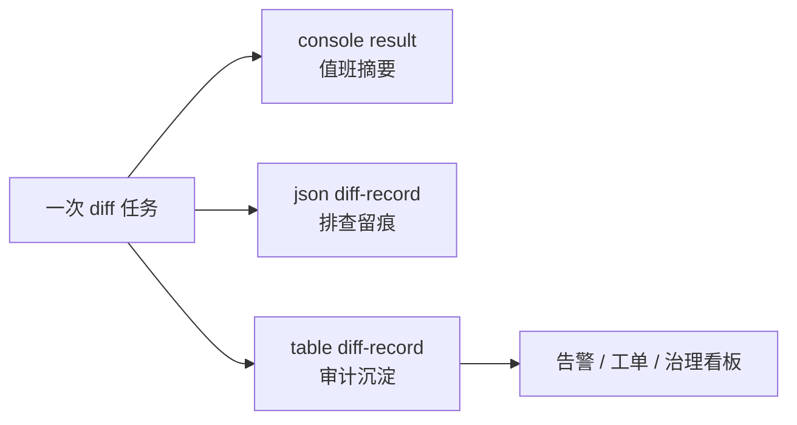
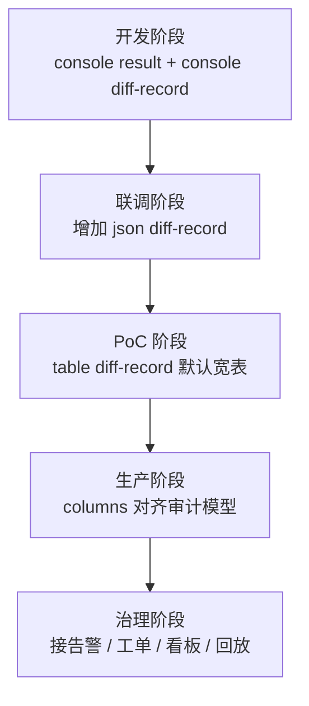

# 04｜结果不是终点：result 与审计闭环

> 导读：
> 本文围绕 Consilens 的 `result` 配置展开，解释一次数据校验任务的结果为什么不该只停留在控制台摘要，而应该继续沉淀到 JSON、结果表、差异明细表，并进一步接入告警、工单、治理看板等审计闭环。文章重点梳理不同 sink 的作用边界、默认输出结构以及从试跑到生产化落库的演进路径。
>
> Github:
> https://github.com/datavane/consilens
> 欢迎关注、Star、Fork，参与贡献

很多人第一次跑数据对账，最关心的是控制台最后那一行：到底有没有差异？

这当然重要。但如果你要把 Consilens 用在生产环境里，只知道“有差异”远远不够。

你还需要知道：差异是什么类型？缺源端还是缺目标端？哪些字段不一致？这次任务属于哪个表、哪个租户、哪个批次？结果能不能落库？能不能进入告警、工单、治理看板？

这就是 `result` 的价值。

它不是简单的输出配置，而是把一次对账任务接入数据治理闭环的入口。

## 先从一个组合输出开始

试跑时，控制台摘要足够：

```yaml
result:
  sinks:
    - format: console
      type: result
```

但生产里更常见的写法，是同时输出摘要、明细和审计表：

```yaml
result:
  failOnSinkError: true
  sinks:
    - format: console
      type: result

    - format: json
      type: diff-record
      properties:
        path: ./output/diff-${taskId}.json
        pretty: true

    - format: table
      type: diff-record
      properties:
        type: postgresql
        url: jdbc:postgresql://localhost:5432/audit
        username: postgres
        password: 123456
        tableName: diff_result_detail
        createTable: true
        batchSize: 1000
```

这段配置的思路很清楚：

- 控制台看任务摘要，方便值班和调试；
- JSON 留一份明细，方便临时排查和二次消费；
- 表 sink 把差异沉淀到审计库，给后续治理系统使用。



如果你希望某个 sink 暂时不生效，不用删除配置，可以加：

```yaml
enabled: false
```

## format 和 type：一个说去哪，一个说写什么

`result.sinks` 里最容易混淆的是 `format` 和 `type`。

`format` 表示输出介质，`type` 表示输出内容层级。

| format | type | 适合场景 |
| --- | --- | --- |
| `console` | `result` | 控制台摘要 |
| `console` | `diff-record` | 控制台查看部分差异明细 |
| `json` | `result` | 结果摘要留痕 |
| `json` | `diff-record` | 差异明细文件 |
| `csv` | `result` | 摘要导出给人看 |
| `csv` | `diff-record` | 明细导出、人工分析、导入其他系统 |
| `table` | `result` | 任务摘要入库 |
| `table` | `diff-record` | 差异明细入库审计 |

用一句话记：

> format 解决“写到哪里”，type 解决“写哪一层结果”。

## failOnSinkError：这次输出失败，任务算不算失败

默认情况下，`failOnSinkError` 是 `true`。也就是说，只要某个 sink 写失败，任务就会失败。

```yaml
result:
  failOnSinkError: false
```

把它改成 `false`，才是“记录告警但主比较流程继续”的模式。这适合开发调试，或者某些辅助输出不关键的场景。

但如果你已经把结果表接到了告警平台、审计报表、治理工单，我建议打开严格模式：

```yaml
result:
  failOnSinkError: true
```

这样任何一个关键 sink 出问题，任务会更早失败。生产里，静默丢结果比任务失败更危险。

## console：最适合试跑和值班

摘要输出：

```yaml
result:
  sinks:
    - format: console
      type: result
      properties:
        showStatistics: true
```

明细输出：

```yaml
result:
  sinks:
    - format: console
      type: diff-record
      properties:
        maxRows: 50
```

`maxRows` 很适合控制台调试。你能看到差异长什么样，又不会把终端刷爆。

控制台输出的定位是“快速看一眼”，不要把它当成生产留痕。

## json：适合留痕和二次消费

结果摘要：

```yaml
result:
  sinks:
    - format: json
      type: result
      properties:
        path: ./output/result-${taskId}.json
        pretty: true
```

差异明细：

```yaml
result:
  sinks:
    - format: json
      type: diff-record
      properties:
        path: ./output/diff-${taskId}.json
        pretty: true
```

如果你希望在默认差异字段基础上补充业务信息，可以使用 `mergeDefaults`：

```yaml
result:
  sinks:
    - format: json
      type: diff-record
      properties:
        path: ./output/diff-${taskId}.json
        pretty: true
        mergeDefaults: true
        columns:
          - name: biz_date
            value: ${src.biz_date}
          - name: tenant_id
            value: ${src.tenant_id}
```

`diff-record` 的默认字段包括：

- `operation`
- `primaryKey`
- `sourceValues`
- `targetValues`
- `changedColumns1`
- `changedColumns2`

对于 `type: result`，可以这样理解：不写 `columns` 就输出默认统计；写了 `columns` 就进入完整自定义输出模式。

## csv：适合给人看，也适合交给其他系统

差异明细 CSV：

```yaml
result:
  sinks:
    - format: csv
      type: diff-record
      properties:
        path: ./output/diff-${taskId}.csv
        delimiter: ","
        includeHeader: true
```

结果摘要 CSV：

```yaml
result:
  sinks:
    - format: csv
      type: result
      properties:
        path: ./output/result-${taskId}.csv
        includeHeader: true
```

CSV 的好处是门槛低。运营、测试、数据分析同学都能打开看，也容易被其他系统导入。

如果是长期生产任务，CSV 更适合作为辅助输出；真正的主链路建议还是落表。

## table：生产审计的主力

表 sink 是最值得认真设计的一类输出。

```yaml
result:
  sinks:
    - format: table
      type: diff-record
      properties:
        type: postgresql
        url: jdbc:postgresql://localhost:5432/audit
        username: postgres
        password: 123456
        tableName: diff_result_detail
        createTable: true
        dropIfExists: false
        batchSize: 1000
```

有两条规则要记住：

1. `properties.type` 必填；
2. 当前表 sink 写入目标支持 `mysql` 和 `postgresql`。

常用参数如下：

| 参数 | 作用 |
| --- | --- |
| `type` | 写入目标数据库类型 |
| `url` / `username` / `password` | 写入连接 |
| `driver` | 可选，覆盖默认驱动 |
| `maxPoolSize` | 连接池大小 |
| `tableName` | 指定表名 |
| `prefix` | 未指定 `tableName` 时的表名前缀 |
| `suffixTimestamp` | 是否自动追加时间戳后缀 |
| `createTable` | 是否自动建表 |
| `dropIfExists` | 是否先删再建 |
| `defaultColumnLength` | 默认字符串列长度 |
| `batchSize` | 批量写入大小 |

开发和 PoC 阶段可以让系统自动建表。到了生产环境，我更建议把表结构纳入数据库变更管理，让结果表成为治理体系的一部分，而不是一个临时输出副产物。

## 默认表结构：快速落地很有用

如果不自定义列，`type: result` 的默认摘要表会包含这些核心列：

- `nl_dq_execution_id`
- `src_table`
- `tgt_table`
- `diff_count`
- `src_missing`
- `tgt_missing`
- `mismatch_count`
- `run_status`
- `completed_at`

`type: diff-record` 的默认宽表会包含：

- `nl_dq_execution_id`
- `nl_dq_diff_type`
- `nl_dq_diff_columns1`
- `nl_dq_diff_columns2`
- 源端字段的 `*_1`
- 目标端字段的 `*_2`

这套默认结构很适合快速落地。尤其是刚开始接 Consilens 时，不要急着过度设计结果模型。先用默认宽表把差异沉淀下来，等治理流程稳定后再自定义。

## columns：把结果改造成你的审计模型

当你要接入公司已有的数据质量平台、审计表、告警系统时，通常需要自定义输出列。

```yaml
result:
  sinks:
    - format: table
      type: diff-record
      properties:
        type: postgresql
        url: jdbc:postgresql://localhost:5432/audit
        username: postgres
        password: 123456
        tableName: diff_result_detail
        createTable: true
        batchSize: 1000
        columns:
          - name: task_id
            value: ${taskId}
            columnType: VARCHAR(64)

          - name: diff_type
            value: ${operation}
            columnType: VARCHAR(32)

          - name: pk_value
            value: ${primaryKey}
            columnType: TEXT

          - name: src_amount
            value: ${src.amount}
            defaultValue: "0"
            columnType: NUMERIC(18,2)

          - name: tgt_amount
            value: ${tgt.amount}
            defaultValue: "0"
            columnType: NUMERIC(18,2)

          - name: changed_columns
            value: ${changedColumns}
            columnType: JSONB

          - name: written_at
            value: ${timestamp}
            columnType: TIMESTAMP
```

每一列都有自己的职责：

- `name`：输出列名；
- `value`：值模板；
- `defaultValue`：值为空时的兜底；
- `columnType`：表 sink 中用于建表和类型转换。

`columnType` 不只是为了建表好看。它还会影响插入时的类型转换。金额、时间、JSON 这类字段，建议显式声明。

## 常用占位符

差异明细 `diff-record` 常用：

| 占位符 | 含义 |
| --- | --- |
| `${taskId}` | 当前任务 ID |
| `${operation}` | 差异类型，如 `mismatch`、`source_missing`、`target_missing` |
| `${primaryKey}` | 主键值字符串 |
| `${changedColumns}` | 变更列数组 JSON |
| `${changedColumns1}` | 源端变更列数组 JSON |
| `${changedColumns2}` | 目标端变更列数组 JSON |
| `${src.col}` | 源端某列值 |
| `${tgt.col}` | 目标端某列值 |
| `${sourceTable}` | 源数据集名称 |
| `${targetTable}` | 目标数据集名称 |
| `${strategy}` | 当前策略 |
| `${algorithm}` | 当前算法 |
| `${timestamp}` | 当前时间 |

最终结果 `result` 常用：

| 占位符 | 含义 |
| --- | --- |
| `${status}` | 整体结果，`EQUAL` 或 `DIFF` |
| `${totalDifferences}` | 总差异数 |
| `${sourceMissingCount}` | 源端缺失数 |
| `${targetMissingCount}` | 目标缺失数 |
| `${mismatchCount}` | 不一致数 |
| `${sourceRowCount}` | 源端行数 |
| `${targetRowCount}` | 目标端行数 |
| `${statistics_json}` | 统计摘要 JSON 字符串 |

也可以写常量：

```yaml
value: production
```

或者把常量和占位符混写：

```yaml
value: task_${taskId}_${operation}
```

## 一个生产结果链路的建议

如果你要从零设计 Consilens 的结果输出，可以按这个顺序走：



1. 开发阶段：`console result` + `console diff-record`，快速看效果；
2. 联调阶段：增加 `json diff-record`，方便保留样例；
3. PoC 阶段：使用 `table diff-record` 默认宽表，先把明细沉淀下来；
4. 生产阶段：设计审计表，用 `columns` 输出公司统一模型；
5. 治理阶段：结果表接告警、工单、看板和回放链路。

做到这一步，Consilens 就不只是一个对账工具，而是数据质量体系里的一个稳定节点。
