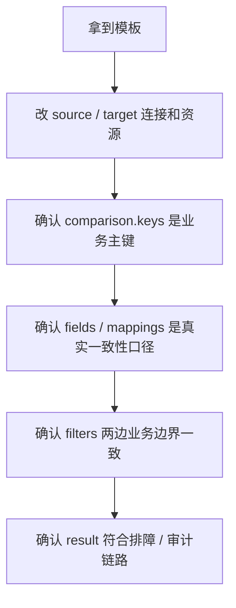

# 05｜七个常见场景，直接拿去改

> 导读：
> 本文把 Consilens 在实际项目里最常见的几类配置场景整理成可直接改造的模板，包括同构表全量核对、忽略审计列、字段映射对齐、按业务切片比较、按时间窗滚动检查以及结果落库等典型用法。重点不是机械复制模板，而是帮助你快速找到最接近自己业务的起点，再按连接信息、主键口径、比较字段和结果链路完成落地。
>
> Github:
> https://github.com/datavane/consilens
> 欢迎关注、Star、Fork，参与贡献

前面几篇讲的是思路。这一篇更直接：把常见场景整理成模板。

模板不是让你无脑复制，而是给你一个可靠起点。真正落地时，至少要改三类内容：连接信息、业务主键、比较字段。

## 场景一：两个同构表做全量核对

适合迁移验收、同构同步链路核验、初次摸底。

```yaml
source:
  type: mysql
  connection:
    url: jdbc:mysql://localhost:3306/ods
    username: root
    password: 123456
  resource:
    type: table
    name: user_info

target:
  type: postgresql
  connection:
    url: jdbc:postgresql://localhost:5432/dwd
    username: postgres
    password: 123456
  resource:
    type: table
    name: user_info

comparison:
  keys:
    source:
      - id
    target:
      - id

strategy:
  mode: checksum
  algorithm: xor

result:
  sinks:
    - format: console
      type: result
```

这里故意没有写 `fields`，系统会比较所有非主键列。第一次摸底很适合这样做。

## 场景二：同构表，但忽略审计列

适合同步链路会重新生成写入时间、批次号、更新时间的情况。

```yaml
comparison:
  keys:
    source:
      - id
    target:
      - id
  exclude:
    source:
      - created_at
      - updated_at
      - sync_time
    target:
      - created_at
      - updated_at
      - sync_time
```

这类配置的关键不是“排除越多越好”，而是只排除那些业务上确实不应该决定一致性的字段。

## 场景三：两边字段名不同，但业务语义一致

适合 ODS 到 DWD、业务库到分析库、旧系统到新系统迁移。

```yaml
comparison:
  keys:
    source:
      - order_id
    target:
      - id
  mappings:
    - name: order_id
      source:
        column: order_id
      target:
        column: id
      key: true

    - name: amount
      source:
        column: pay_amount
      target:
        column: total_amount

    - name: status
      source:
        column: order_status
      target:
        column: status
```

这里用 `mappings` 把两边投影成同一套逻辑字段。结果里看到的是 `order_id`、`amount`、`status`，比直接看两边原始字段名更容易理解。

## 场景四：先做业务塑形，再比较

适合两边不是简单字段改名，而是需要过滤、投影、表达式处理。

```yaml
source:
  type: mysql
  connection:
    url: jdbc:mysql://localhost:3306/ods
    username: root
    password: 123456
  resource:
    type: sql
    path: |
      SELECT
        order_id,
        buyer_id,
        DATE(pay_time) AS biz_date,
        amount
      FROM ods_order
      WHERE pay_status = 'SUCCESS'

target:
  type: postgresql
  connection:
    url: jdbc:postgresql://localhost:5432/dwd
    username: postgres
    password: 123456
  resource:
    type: sql
    path: |
      SELECT
        order_id,
        buyer_id,
        biz_date,
        paid_amount AS amount
      FROM dwd_paid_order

comparison:
  keys:
    source:
      - order_id
    target:
      - order_id
  fields:
    source:
      - buyer_id
      - biz_date
      - amount
    target:
      - buyer_id
      - biz_date
      - amount

strategy:
  mode: checksum
  algorithm: xor
```

如果你已经选择 SQL 资源，就尽量在 SQL 里把字段口径整理清楚。这样比在多个配置块之间来回跳更容易排障。

## 场景五：只比较某个业务切片

适合按天、按租户、按业务状态做校验。

```yaml
comparison:
  keys:
    source:
      - order_id
    target:
      - order_id
  fields:
    source:
      - buyer_id
      - amount
      - status
    target:
      - buyer_id
      - amount
      - status
  filters:
    source: "dt = '2026-05-05' AND tenant_id = 1001"
    target: "dt = '2026-05-05' AND tenant_id = 1001"
```

注意：两边过滤条件表达的业务边界必须一致。字段名可以不同，但业务口径不能不同。

## 场景六：按批次滚动检查最近变更

适合增量同步链路、订单状态校验、需要持续巡检但当前仍由外部调度控窗的场景。

```yaml
comparison:
  keys:
    source:
      - order_id
    target:
      - order_id
  fields:
    source:
      - buyer_id
      - amount
      - order_status
      - updated_at
    target:
      - buyer_id
      - amount
      - order_status
      - updated_at
  filters:
    source: "updated_at >= '2026-05-10 09:00:00' AND updated_at < '2026-05-10 09:30:00'"
    target: "updated_at >= '2026-05-10 09:00:00' AND updated_at < '2026-05-10 09:30:00'"
```

这里的时间窗应该由外部调度系统按批次改写，持续校验要用“调度 + filters”来实现。

## 场景七：差异明细沉淀到审计表

适合生产环境接告警、治理平台、工单和审计报表。

```yaml
result:
  failOnSinkError: true
  sinks:
    - format: console
      type: result

    - format: table
      type: diff-record
      properties:
        type: postgresql
        url: jdbc:postgresql://localhost:5432/audit
        username: postgres
        password: 123456
        tableName: diff_result_detail
        createTable: true
        batchSize: 1000
```

如果只是 PoC，可以先用默认表结构。进入生产后，再根据公司审计模型用 `columns` 自定义输出。

## 一个完整生产模板

下面是一份更接近生产的订单校验配置。它把字段对齐、类型标准化和结果落库都放进来了。

```yaml
source:
  type: mysql
  name: order-source
  connection:
    url: jdbc:mysql://localhost:3306/ods?useSSL=false&serverTimezone=UTC
    username: root
    password: 123456
  resource:
    type: table
    name: ods_order
  readOptions:
    fetchSize: 2000

target:
  type: postgresql
  name: order-target
  connection:
    url: jdbc:postgresql://localhost:5432/dwd?currentSchema=public
    username: postgres
    password: 123456
  resource:
    type: table
    name: dwd_order

comparison:
  keys:
    source:
      - order_id
    target:
      - id
  mappings:
    - name: order_id
      source:
        column: order_id
      target:
        column: id
      key: true
    - name: buyer_id
      source:
        column: buyer_id
      target:
        column: buyer_id
    - name: amount
      source:
        column: amount
      target:
        column: total_amount
    - name: order_status
      source:
        column: status
      target:
        column: order_status
    - name: updated_at
      source:
        column: updated_at
      target:
        column: updated_at
  filters:
    source: "tenant_id = 1001"
    target: "tenant_id = 1001"

normalization:
  global:
    decimal:
      precision: 2
      rounding: true
    timestamp:
      format: "yyyy-MM-dd HH:mm:ss"
      timezone: "UTC"
      comparisonMode: "TRUNCATE_TO_SECOND"

strategy:
  mode: checksum
  algorithm: xor
  bisectionFactor: 4
  bisectionThreshold: 20000
  batchSize: 2000
  localCompare:
    mode: full

result:
  failOnSinkError: true
  sinks:
    - format: console
      type: result
    - format: table
      type: diff-record
      properties:
        type: postgresql
        url: jdbc:postgresql://localhost:5432/audit
        username: postgres
        password: 123456
        tableName: diff_result_detail
        createTable: true
        batchSize: 1000
        columns:
          - name: task_id
            value: ${taskId}
            columnType: VARCHAR(64)
          - name: diff_type
            value: ${operation}
            columnType: VARCHAR(32)
          - name: pk_value
            value: ${primaryKey}
            columnType: TEXT
          - name: changed_columns
            value: ${changedColumns}
            columnType: JSONB
          - name: written_at
            value: ${timestamp}
            columnType: TIMESTAMP
```

如果你还需要“滚动窗口巡检”，请让调度系统按批次改写 `comparison.filters`。

这份模板不一定适合直接上生产，但它展示了一个成熟任务应该具备的结构：数据集清楚、比较口径清楚、策略清楚、结果去向清楚。

## 使用模板前，先改这五处

拿到任何模板，都先检查：



1. `source` / `target` 连接和资源是否正确；
2. `comparison.keys` 是否真的是业务主键；
3. `fields` 或 `mappings` 是否表达了真实一致性口径；
4. `filters` 是否两边边界一致；
5. `result` 是否符合你的排障、审计和治理链路。

模板的价值不是替你思考，而是帮你少走弯路。
