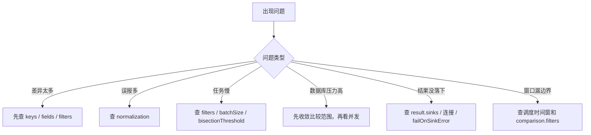

# 06｜Consilens 配置速查：理解之后，用来回查

> 导读：
> 本文不是一篇从零入门的教程，而是一份适合放在手边随时回查的配置速查稿。它会把 Consilens 常用配置项按 `source / target`、`comparison`、`strategy`、`normalization`、`concurrency`、`result` 这些层次重新整理，帮助你在已经理解整体思路之后，快速确认字段职责、配置边界和排查入口。
>
> Github:
> https://github.com/datavane/consilens
> 欢迎关注、Star、Fork，参与贡献

这份速查更适合下面两类场景：

- 你已经跑过任务，现在需要快速回忆某个字段该放在哪一层；
- 你已经读过前面的文章，现在想在现场排障或改配置时少来回翻全文。

如果你是第一次接触 Consilens，建议先从 `00` 到 `05` 建立整体心智模型，再回到这篇做查阅。

## 一份配置的主线

```text
source / target  →  comparison  →  strategy  →  result
   数据从哪里来       怎样才算相同        怎么执行        结果去哪里
```


扩展能力：

- `normalization`：跨库类型标准化；
- `concurrency`：并发调优；
- `readOptions`：读取参数控制。

## source / target

| 字段 | 说明 |
| --- | --- |
| `type` | 数据源类型，如 `mysql`、`postgresql`、`oracle`、`doris`、`starrocks` 等 |
| `name` | 任务中的数据源名称，建议长期任务填写 |
| `connection.url` | JDBC 地址 |
| `connection.username` | 用户名 |
| `connection.password` | 密码 |
| `resource.type` | `table` 或 `sql` |
| `resource.name` | 表资源名称，`type: table` 时使用 |
| `resource.path` | SQL 文本，`type: sql` 时使用 |
| `readOptions.fetchSize` | JDBC 读取批量参数，适合大表调优 |

经验：表资源适合物理表直比；SQL 资源适合先整理业务口径再比较。

## comparison

| 字段 | 说明 |
| --- | --- |
| `keys.source` / `keys.target` | 必填。两侧业务主键，数量要一一对应 |
| `fields.source` / `fields.target` | 要比较的字段；不写时比较所有非主键列 |
| `exclude.source` / `exclude.target` | 从比较字段中排除噪音列 |
| `filters.source` / `filters.target` | 两侧过滤条件，建议两边同时配置 |
| `mappings` | 字段名不同、表达式不同但业务语义相同时使用 |
| `extraColumns` | 不参与比较，但可作为差异结果上下文字段带出；更适合和 `fields` 搭配使用 |

经验：`fields` 和 `mappings` 选一条路。SQL 资源里已经整理过字段时，不要再过度使用 `mappings`。

## mappings

| 字段 | 说明 |
| --- | --- |
| `name` | 逻辑字段名 |
| `source.column` / `target.column` | 直接取列 |
| `source.expression` / `target.expression` | 表达式投影 |
| `source.literal` / `target.literal` | 常量 |
| `key: true` | 映射后的逻辑主键字段 |
| `compare: false` | 不进入比较字段集合；当前不要把它当成“自动随差异结果透出上下文”的能力 |

注意：即使用了 `mappings`，`comparison.keys` 仍然必须配置。

## strategy

| 字段 | 说明 | 建议 |
| --- | --- | --- |
| `mode` | `checksum` 或 `join` | 跨库默认 `checksum` |
| `algorithm` | 校验算法 | 常用 `xor` |
| `bisectionFactor` | 差异段拆分因子 | 常用 `4` |
| `bisectionThreshold` | 小段阈值 | 可从 `20000` 起步 |
| `batchSize` | 单批读取大小 | 可从 `1000` 或 `2000` 起步 |
| `enableProfiling` | 剖析日志 | 排障时打开 |
| `localCompare.mode` | `full` 或 `row-hash` | 默认 `full` 更稳 |

经验：能明确证明同域可 Join，再用 `join`；否则从 `checksum` 开始。

## normalization

| 类型 | 常见用途 |
| --- | --- |
| `decimal` | 金额、税额、汇率精度统一 |
| `timestamp` | 时间格式、时区、精度统一 |
| `boolean` | `1/0`、`true/false` 等布尔语义统一 |
| `binary` | `hex`、`base64` 编码统一 |
| `string` | NULL 和空串语义统一 |

常见时间比较模式：

- `EXACT`
- `DATE_ONLY`
- `TRUNCATE_TO_SECOND`
- `TRUNCATE_TO_DAY`

经验：大量 mismatch 先看布尔、时间、金额、NULL，而不是急着怀疑数据链路。

## 滚动窗口校验

当前 CLI 配置模型**没有** `realtime` 顶层节点。

如果你要做持续校验，正确做法是：

1. 外部调度系统计算本轮时间窗；
2. 把窗口写进 `comparison.filters.source` / `comparison.filters.target`；
3. 由外部系统记录 checkpoint。

经验：安全延迟和窗口重叠仍然重要，只是它们现在属于调度层，而不是当前 CLI 的内建配置项。

## result

| format | type | 用途 |
| --- | --- | --- |
| `console` | `result` | 控制台摘要 |
| `console` | `diff-record` | 控制台差异明细 |
| `json` | `result` | 摘要文件 |
| `json` | `diff-record` | 明细文件 |
| `csv` | `result` | 摘要 CSV |
| `csv` | `diff-record` | 明细 CSV |
| `table` | `result` | 摘要入库 |
| `table` | `diff-record` | 明细入库 |

表 sink 当前写入目标支持：`mysql`、`postgresql`。

`failOnSinkError`：

- `false`：sink 失败时记录告警，主流程继续；
- `true`：sink 失败则任务失败，适合生产审计链路。

## columns 常用占位符

差异明细：

| 占位符 | 含义 |
| --- | --- |
| `${taskId}` | 当前任务 ID |
| `${operation}` | 差异类型 |
| `${primaryKey}` | 主键值 |
| `${changedColumns}` | 变更列 JSON |
| `${src.col}` | 源端列值 |
| `${tgt.col}` | 目标端列值 |
| `${timestamp}` | 当前时间 |

最终结果：

| 占位符 | 含义 |
| --- | --- |
| `${status}` | `EQUAL` 或 `DIFF` |
| `${totalDifferences}` | 总差异数 |
| `${sourceMissingCount}` | 源端缺失数 |
| `${targetMissingCount}` | 目标端缺失数 |
| `${mismatchCount}` | 不一致数 |
| `${sourceRowCount}` | 源端行数 |
| `${targetRowCount}` | 目标端行数 |
| `${statistics_json}` | 统计摘要 JSON |

## 排查顺序

1. 结果差异很多：先看 `keys`、`fields`、`filters` 是否口径一致。
2. 大量字段误报：看 `normalization`，尤其是时间、金额、布尔、NULL。
3. 任务慢：看 `filters`、`strategy.batchSize`、`bisectionThreshold`。
4. 数据库压力高：先收敛比较范围，再考虑并发。
5. 结果没落下来：看 `result.sinks`、连接配置、`failOnSinkError`。
6. 滚动窗口任务漏边界：先看调度层怎么算时间窗，再看 `comparison.filters` 是否和业务窗口一致。



最后一句：配置不是为了把字段填满，而是把业务边界讲清楚。
